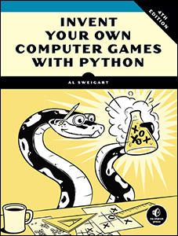

<h1 align="center">inventGamesPython</h1>

<h3 align="center">Invent your own computer games with Python - exercises</h3>

---
This repository contains TODO programming tasks, given in every chapter of the book. The purpose of the repository is to practice Python programming language, with git version control, markdown syntax etc.

* **CHAPTER 3** - [Guess the number.](https://github.com/st33ze/inventGamesPython/tree/master/chapter_03/guess.py)

* **CHAPTER 4** - [A Joke-telling program.](https://github.com/st33ze/inventGamesPython/tree/master/chapter_04/jokes.py)

* **CHAPTER 5** - [Dragon Realm.](https://github.com/st33ze/inventGamesPython/tree/master/chapter_05/dragon.py)

* **CHAPTER 8** - [Hangman.](https://github.com/st33ze/inventGamesPython/tree/master/chapter_08)

* **CHAPTER 10** - [Tic Tac Toe.](https://github.com/st33ze/inventGamesPython/tree/master/chapter_10)

* **CHAPTER 11** - [Bagels](https://github.com/st33ze/inventGamesPython/tree/master/chapter_11/bagels.py)